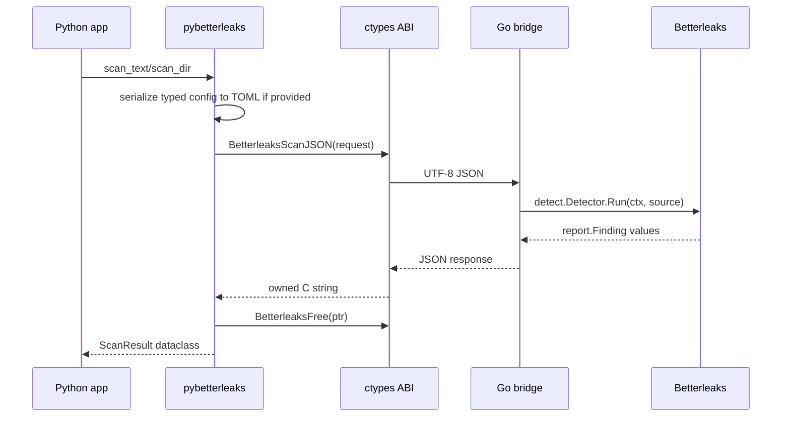

# Architecture

## High-Level Design

PyBetterleaks has four layers:

```text
Python application
  -> pybetterleaks Python API
    -> ctypes JSON ABI
      -> Go shared library bridge
        -> Betterleaks Go packages
```

The Python package owns the user-facing API. The Go bridge stays small and
stable. Betterleaks remains the scanning engine.

## Why A JSON C ABI

Go can export functions from a `main` package when built with
`-buildmode=c-shared`. The exported ABI stays intentionally tiny:

```go
//export BetterleaksScanJSON
func BetterleaksScanJSON(requestJSON *C.char) *C.char

//export BetterleaksCancel
func BetterleaksCancel(requestID *C.char) *C.char

//export BetterleaksVersion
func BetterleaksVersion() *C.char

//export BetterleaksFree
func BetterleaksFree(ptr *C.char)
```

Passing nested structs over C directly would create memory-management and
compatibility work for little gain. JSON keeps the boundary debuggable and
stable.

## Request Flow



## Config Model

`BetterleaksConfig` is a Python dataclass model for Betterleaks TOML. It does
not replace Betterleaks config parsing. For a typed config scan, Python
serializes the dataclass model to TOML and sends that TOML string through the
JSON ABI as `config_toml`.

The Go bridge parses inline TOML with Betterleaks' own `config.ParseTOMLString`.
For user-owned TOML files, callers can still pass `config_path`, and the bridge
loads the file with Betterleaks' `config.LoadFile`.

## Async Model

`scan_text_async` and `scan_dir_async` run the synchronous scan in an executor.
Each async call gets a request id. If the Python task is cancelled, the SDK
calls `BetterleaksCancel(request_id)`, which cancels the Go context registered
for that active scan.

This is cooperative cancellation:

- Python cancellation is immediate for the awaiting task.
- The native scan exits when Betterleaks observes the cancelled context.
- A scan can finish before `BetterleaksCancel` arrives.

## Native Loader

The native loader:

- detects the operating system
- locates the packaged library in `pybetterleaks/native/`
- loads it with `ctypes.CDLL`
- configures `argtypes` and `restype`
- calls `BetterleaksFree` for allocated native responses
- raises clear exceptions when the native library is missing or malformed

Expected library names:

```text
Linux:   libbetterleaks_py.so
macOS:   libbetterleaks_py.dylib
Windows: betterleaks_py.dll
```

## Build Model

Build-time:

- GitHub Actions installs Go.
- `scripts/build_native.py` compiles `bridge` with `go build`.
- The native library is copied into `python/pybetterleaks/native/`.
- Python wheel build packages that native library as package data.
- `cibuildwheel` tests the built wheel in a clean environment.

Runtime:

- User imports `pybetterleaks`.
- Python loads the bundled native library.
- Python sends JSON scan requests to the native library.
- Native library calls Betterleaks packages directly.
- Native library returns JSON scan results.

No runtime subprocess is required.

## Git Worktree Scans

`scan_git(..., scope="worktree")` is intentionally conservative. It validates
that the target is inside a local Git worktree, scans the working tree through
the same Betterleaks file source used by `scan_dir`, and skips `.git` metadata.

It does not call the `git` executable at runtime. Upstream Betterleaks' history
and diff source currently shells out to Git, so PyBetterleaks does not expose
history, staged-only, or diff scopes until those can be implemented without
weakening the no-runtime-subprocess promise.

## CI Architecture

Workflows:

- `ci.yml`: Python lint, type check, native bridge build for coverage-gated
  tests, Betterleaks pin check, Go checks, `staticcheck`, and `govulncheck`.
- `docs.yml`: strict MkDocs build and GitHub Pages deploy on `main`.
- `e2e.yml`: Docker runtime-wheel E2E on a glibc Python image.
- `wheels.yml`: `cibuildwheel` platform builds, wheel smoke tests, and artifact
  inspection.
- `publish.yml`: tag-only trusted publishing, wheel inspection, checksum
  generation and verification, artifact attestations, PyPI smoke, and GitHub
  release notes.

## Versioning

There are two versions to track:

- Python package version, for example `0.5.0`.
- Bundled Betterleaks version, for example `v1.6.1`.

Expose both:

```python
import pybetterleaks

print(pybetterleaks.__version__)
print(pybetterleaks.betterleaks_version())
```

Release notes should always say which Betterleaks version is bundled.

## Musllinux Status

Alpine currently fails while loading the Go shared library through Python
`ctypes`:

```text
initial-exec TLS resolves to dynamic definition
```

This is a Go + musl shared-library loader limitation, not a missing Alpine
package. The same error reproduces when Betterleaks is built as a Go
`c-archive` and linked into a musl shared object. Until that loader path is
fixed, musllinux/Alpine is unsupported and must remain absent from the published
wheel matrix.

## Future Architecture

Possible later additions:

- git scan mode
- streaming native callback API for large scans
- provider source wrappers for GitHub, GitLab, Hugging Face, and S3
- artifact signing and SBOM generation
